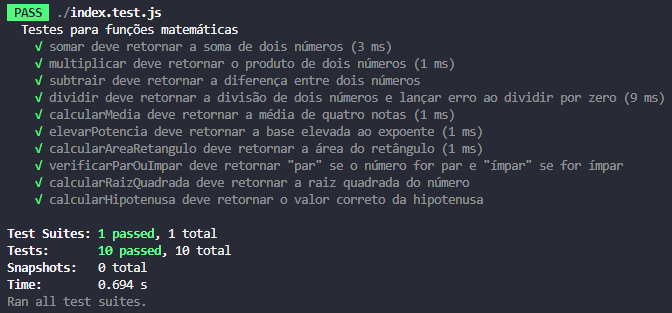

# 🚀 Lista de exercícios Javascript

Bem-vindo à lista de exercícios sobre JavaScript! 🎉 Siga as instruções abaixo responder a lista. 💪

---

## ⚙️ Como realizar o exercício

### 1️⃣ - Clonar o repositório 🖥️

Para começar, você deve clonar este repositório na sua máquina. Abra o terminal e execute o seguinte comando:

```bash
git clone https://github.com/profrafamatos/11-lista-js-1.git
```

### 2️⃣ - Navegar até a pasta do repositório 📂

Agora, entre na pasta do repositório que você acabou de clonar:

```bash
cd 11-lista-js-1
```


### 3️⃣ - Instalar as dependências 📦

Este projeto utiliza algumas dependências que precisam ser instaladas antes de rodar os testes. No terminal, execute o seguinte comando para instalar tudo direitinho:

```bash
npm install
```

⚠️ **Atenção:** Isso irá instalar todas as dependências listadas no arquivo package.json.


### 4️⃣ - Resolver o exercício ✍️

Agora, a parte divertida! Abra o arquivo index.js no VSCode ou em seu editor de preferência. 🛠️ Lá você encontrará comentários com as instruções. Resolva o exercício escrevendo o código na área indicada!


⚠️ *** Importante: *** Não altere o arquivo index.test.js. Esse arquivo contém os testes automatizados e não deve ser modificado. Qualquer mudança nele pode interferir no seu resultado esperado!


### 5️⃣ - Rodar os testes ✅
Terminou a sua solução? Ótimo! 🎉 Agora é hora de verificar se está tudo funcionando. No terminal, execute o comando abaixo para rodar os testes automatizados:

```bash
npm test
```

- ✅ Se sua solução estiver correta, todos os testes passarão com sucesso! e uma imagem semelhante a apresentada abaixo será exibida. 🎉
- ❌ Se algo der errado, o terminal vai te avisar quais testes falharam, e você pode ajustar seu código. Não desanime, faz parte do processo! 💡



---
## 🚀 Agora, mãos à obra e divirta-se programando! 😄👩‍💻👨‍💻
